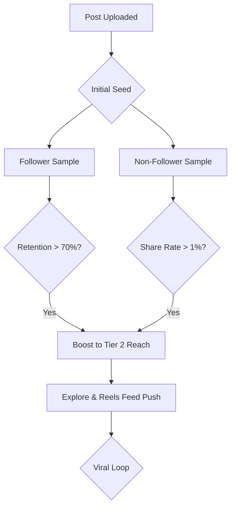

# The Instagram Algorithm: 2026 Ranking Signals Deep Dive

To master Instagram in 2026, you must understand the "Intelligence Layer" that governs every interaction. Instagram uses a sophisticated ensemble of AI models (including Large Language Models for caption analysis and Computer Vision for video content) to rank content across four main surfaces.

## The 2026 Core Signals Ensemble

### 1. Watch Time & "Attention Velocity"
In 2026, it's not just about *total* watch time, but the **Velocity** of attention.
- **Micro-Retention:** The algorithm tracks second-by-second drop-offs. If 90% of users leave at the 3-second mark, that Reel is flagged as "Clickbait" and distribution is throttled.
- **Re-watch Rate:** This is the highest weight signal for Reels. If a user watches twice, the AI assumes high value and pushes it to "Similar Interest" nodes.

### 2. Semantic Relevance (The LLM Layer)
Instagram's AI now "understands" the context of your video, the text on screen, and your caption using semantic analysis.
- **Topic Clustering:** Your account is assigned to a "Topic Cluster" (e.g., "SaaS Marketing for Gen Z").
- **Mismatched Signals:** If your video is about "Cooking" but your caption is about "Crypto," the algorithm lowers the "Confidence Score" and reduces reach.

---

## Ranking Factors by Surface: Technical Breakdown

### Feed Ranking (Personalized Connectivity)
- **Relationship Score:** Calculated based on DM frequency, tagged photos, and history of likes/comments.
- **Timeliness (Decay Function):** New posts have a higher weight, but "High-Value" posts can stay in the feed for up to 4 days if engagement remains steady.
- **Format Preference:** If a user spends 80% of their time on Carousels, the AI will prioritize Carousels in their Feed.

### Reels Ranking (Unconnected Discovery)
- **Visual Signal Processing:** AI detects "Originality." Watermarked or low-bitrate videos are deprioritized.
- **Audio Popularity Index:** Tracking how many people are creating content with a specific audio vs. how many are skipping it.
- **Viewer History:** Tracking the "Vibe" of Reels the user finishes.

### Explore Ranking (Interest Mapping)
- **Post Popularity (The Viral Seed):** How fast people who *don't* follow you are interacting with the post.
- **Similarity Mapping:** If User A likes Post X, and User B likes Post X, then User A might like Post Y (which User B also liked).

---

## The "Original Content" Enforcement
Instagram's "Originality Classifier" (updated late 2025) is aggressive.
- **Signature Detection:** Every video has a digital signature. Reposting a video that has already been viral on TikTok or IG reduces reach by up to 95%.
- **Aggregator Penalty:** Accounts that post >50% non-original content are excluded from recommendations entirely.

## Summary: The Ranking Logic Flow

[Next: Reels Domination](../reels/strategy.md)
