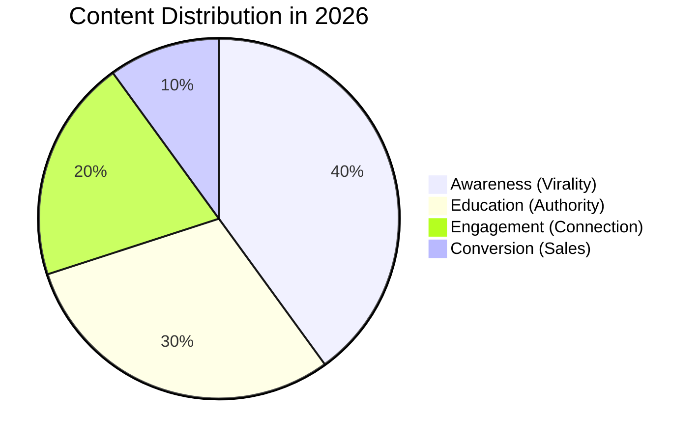

# Content Psychology & Pillars

To grow to 1,000,000 followers, you need a strategy that goes beyond "posting consistently." You need a content ecosystem that balances **Reach**, **Authority**, and **Trust**.

## The Content Ecosystem Model

## The 4 Content Pillars in Depth

### 1. Awareness (Virality)
Broad topics, relatable memes, and high-energy Reels.
- **Goal:** Reach new audiences (Non-followers).
- **Example:** "POV: You just discovered the secret [Niche] hack."
- **Key Metric:** Share Rate.

### 2. Education (Authority)
How-to guides, carousels, and deep-dives.
- **Goal:** Prove you know what you're talking about.
- **Example:** "The 5-step framework to [Result] using AI."
- **Key Metric:** Save Rate.

### 3. Engagement (Connection)
POV stories, Q&As, and controversial opinions.
- **Goal:** Turn followers into fans.
- **Example:** "Why I think [Popular Opinion] is wrong. Change my mind."
- **Key Metric:** Comment Velocity.

### 4. Conversion (Sales)
Success stories, client testimonials, and direct offers.
- **Goal:** Drive revenue and lead generation.
- **Example:** "How my student went from 0 to $10k/month in 90 days."
- **Key Metric:** Link Clicks / DM Leads.

---

## Psychological Triggers for 2026

- **The "Zeigarnik Effect" (Curiosity Loops):** Opening a "Story Gap" by mentioning a result but withholding the method until the end of the video.
- **The "Pratfall Effect" (Relatability):** Showing a mistake or a failure builds more trust than showing a perfect, polished life.
- **Micro-Dopamine:** Using fast cuts, satisfying sounds (SFX), and bright colors to keep the viewer in a "high-arousal" state of attention.
- **Reciprocity:** Giving away so much value for free that the user feels "indebted" to follow or buy from you.

> [!TIP]
> **Visual Reference:** [INSERT DIAGRAM SHOWING THE PSYCHOLOGICAL LOOP OF ATTENTION]

## Storytelling Frameworks
- **The Hero's Journey (Micro-version):**
  - 1. **Problem:** "I was stuck at X."
  - 2. **Struggle:** "I tried Y and Z but failed."
  - 3. **Discovery:** "Then I found this [Tool/Method]."
  - 4. **Result:** "Now I'm at A."
- **The Contrast:** Show the "Old Way" vs. the "New (AI) Way" to highlight efficiency.

[Next: Content Calendars & Growth Plans](calendars-and-plans.md)
