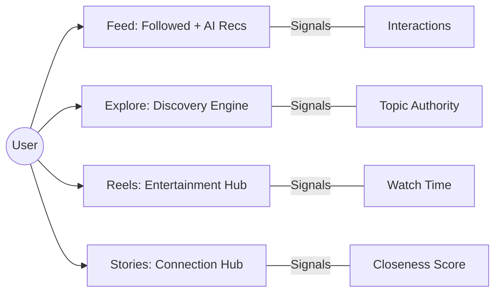
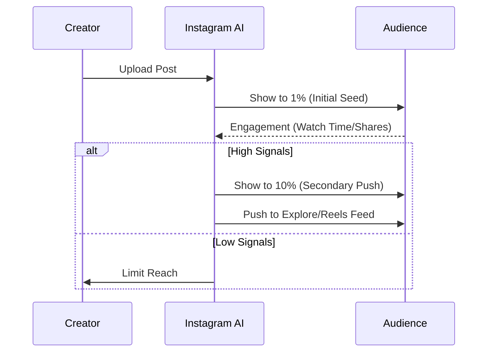

# Instagram Fundamentals (2026 Edition)

Understanding how Instagram works is the prerequisite for growth. In 2026, Instagram is no longer just a "photo-sharing app"—it is an AI-driven discovery engine and a full-funnel commerce platform.

## The Distribution Ecosystem

## How Instagram Works

Instagram uses multiple AI-driven ranking systems, each tailored to a different surface of the app.

### 1. The Feed
The Feed is where you see content from people you follow, plus recommended content that the AI thinks you will love.
- **Goal:** Connection and Retention.
- **Top Signals:** Information about the post, information about the author, and your history of interacting with that person.

### 2. Explore
The Explore page is the discovery engine. Most content here comes from accounts you *don't* follow.
- **Goal:** Discovery and Interest Matching.
- **Top Signals:** Post popularity, your past behavior in Explore, and the creator's authority in a niche.

### 3. Reels
Reels is the entertainment hub. Like Explore, it focuses on discovery but is optimized for short-form video.
- **Goal:** Pure Entertainment and Watch Time.
- **Top Signals:** Watch time, completion rate, rewatches, and "sends per reach" (DM shares).

### 4. Stories
Stories are for your "Inner Circle." They are ephemeral (24 hours) and highly personal.
- **Goal:** Community Depth and Loyalty.
- **Top Signals:** Interaction history (likes, replies, shares).

### 5. Broadcast Channels & Notes
- **Broadcast Channels:** One-to-many messaging for creators to reach their most loyal fans.
- **Notes:** Short status updates (up to 60 characters) appearing at the top of the Inbox. High engagement for Gen Z and "Inner Circle" updates.

### 6. Threads Integration
Threads is the text-based conversational layer of the Instagram ecosystem. Content from Threads is frequently cross-promoted in the Instagram Feed to drive "cross-pollination" of audiences.

---

## The Content Distribution System (2026)

In 2026, the distribution system follows a "Test and Expand" model:

## Ranking Systems Summary

| Surface | Primary Goal | Key Metric |
|---------|--------------|------------|
| **Feed** | Relationship | Engagement History |
| **Explore** | Discovery | Post Popularity |
| **Reels** | Entertainment | Watch Time + Shares |
| **Stories** | Connection | Reply Rate |

[Next: Niche Research](../niche-research/niche-analysis.md)
