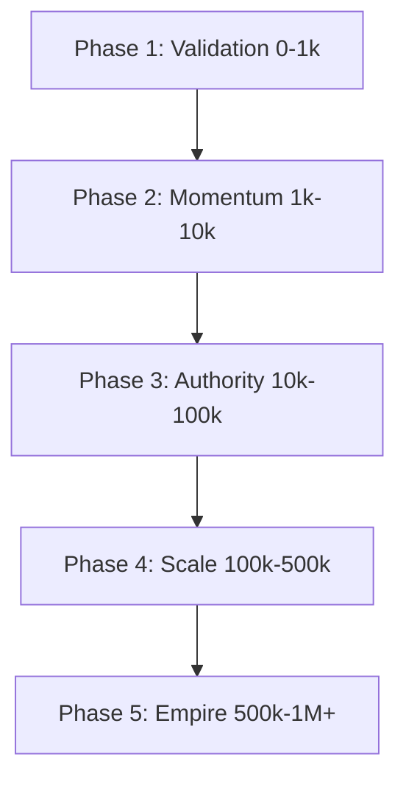
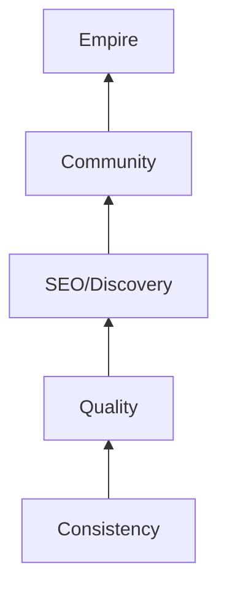

# The Phased Growth System: From 0 to 1M+

Growth on Instagram is not linear. It happens in "stair-steps." This system outlines exactly what to focus on at each stage of your journey.

## Phase Overview

## PHASE 1: 0 → 1,000 Followers (The Validation Phase)
- **Primary Goal:** Prove your niche and content style works.
- **Daily Actions:** 1 Reel, Engage with 5 large creators in your niche (leave thoughtful comments).
- **Weekly Actions:** Analyze your "Reach" and see which Reel had the highest "Initial Seed" watch time.
- **KPIs:** Reach, Follower Growth Rate.
- **Strategy:** Use broad, viral hooks. Don't worry about "Perfect Branding" yet. Focus on volume and finding your first "Winner."
- **Common Pitfall:** Spending too much time on logo design instead of content.

## PHASE 2: 1,000 → 10,000 (The Momentum Phase)
- **Primary Goal:** Establish Niche Authority.
- **Daily Actions:** 1 Reel, 3-5 Stories (using engagement stickers).
- **Weekly Actions:** 1 Educational Carousel.
- **KPIs:** Save Rate, Completion Rate.
- **Strategy:** Double down on the 2-3 topics that perform best. Optimize your Bio for SEO. Start building an email list (Lead Magnet).
- **Common Pitfall:** Chasing generic trends that don't relate to your niche.

## PHASE 3: 1,000 → 100,000 (The Authority Phase)
- **Primary Goal:** Build a "Cult" Following and Community.
- **Daily Actions:** 1-2 Reels, Active Story storytelling, DMing new followers.
- **Weekly Actions:** 2 Carousels, 1 Broadcast Channel update.
- **KPIs:** Share Rate (Sends per Reach), DM Conversations.
- **Strategy:** Focus on shareable content (memes, infographics, shocking facts). Implement ManyChat for automated DM flows.
- **Common Pitfall:** Neglecting the community as you grow.

## PHASE 4: 100,000 → 500,000 (The Scale Phase)
- **Primary Goal:** Omnipresence and Optimization.
- **Daily Actions:** 2 Reels (morning/evening), Story "Sales" sequences.
- **Weekly Actions:** Collaborations with other creators (Collab Posts).
- **KPIs:** Total Monthly Reach, Revenue per Follower.
- **Strategy:** Use AI to repurpose content. Scale your production team (editors/VAs). Start testing "Face-to-Camera" content if you were faceless.
- **Common Pitfall:** Burnt out due to lack of systems/automation.

## PHASE 5: 500,000 → 1,000,000+ (The Empire Phase)
- **Primary Goal:** Cultural Impact and Multi-Channel Diversification.
- **Daily Actions:** High-quality production, maintaining community through Broadcast Channels.
- **Weekly Actions:** Large-scale brand partnerships and product launches.
- **KPIs:** Brand Sentiment, External Website Traffic.
- **Strategy:** Move your audience to an Email List or Paid Community to "own" the relationship. Focus on "Long-Form" content via Threads or YouTube.
- **Common Pitfall:** Getting "comfortable" and missing the next platform shift.

---

## The Growth Pyramid

## The "Golden Rule" of Growth
In 2026, **Consistency > Frequency**. It is better to post 3 high-quality, high-retention Reels per week than 7 low-quality ones that hurt your account's "Ranking Score."

[Next: Engagement & Community Building](../engagement/engagement-strategy.md)
